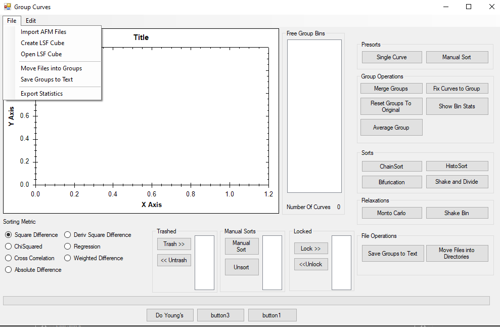
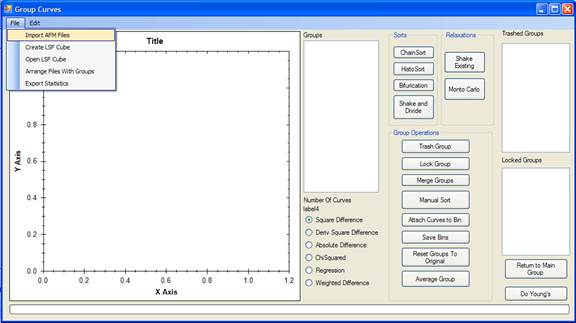
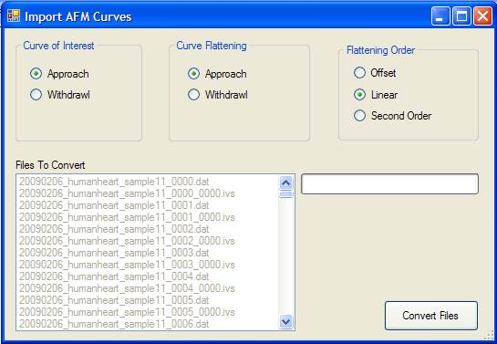
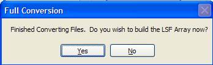
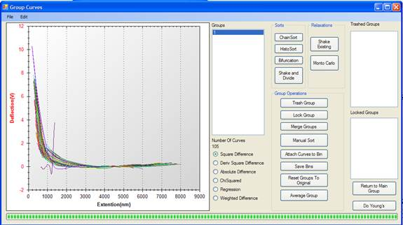
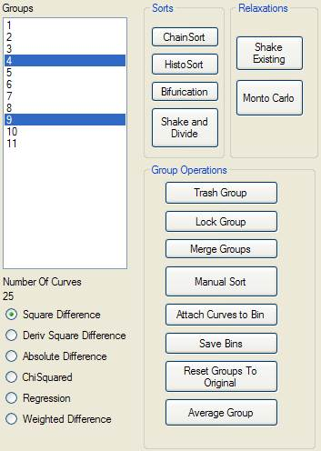
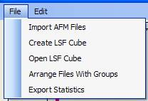
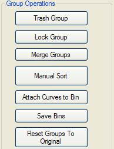

# AFM_MICurve_Aligner


## Program Overview

This program is designed to load force spectroscopy files from Molecular Imaging, Leystone, or Agilent Atomic Force Microscopes. It aligns all the curves to enable the collection of force-distance statistics. The program utilizes various techniques to align the curves and includes data loaders for different file formats.


 
## Quick Start Guide

### Importing AFM Files

To start, you must import your AFM files into the program. Select the folder where the curves reside (one experiment per folder). Click **File**, and then **Import AFM Files**.



### Specifying Comparison and Flattening

Specify how you wish to compare the curves (approach or withdrawal). Set the curve of interest to get this information. Next, specify how you would like to flatten the curves to zero force (approach or withdrawal) and then specify the order of flattening to apply. Click **Convert Files**.



If you have LabVIEW DAT files in the same folder as the AFM files, the program will ask if you wish to combine the files.


The program will then convert all the files to the correct format in the same folder.



### Building the LSF Array

You will be asked if you wish to build the LSF array (the correlation matrix for all the files). If you specify yes, the array will be built at this point. Be aware that this process takes a long time; you might want to leave it running overnight for large datasets.

Once the dataset is built, it will be saved to the same folder as an LSF file, which can be reopened as desired.



### Sorting Curves into Groups

Click on the number of Groups to see a representative sampling of the curves. Now it's time to sort the curves into their groups. Click on either **Chain Sort**, **HistoSort**, **Bifurcation**, or **Shake and Divide** to separate the groups. The program will attempt to sort the curves, and you can review the results. 

To improve the separations, use the **Relaxation** buttons. **Shake** will place the curves in the best guess folders, and **Monte Carlo** will add some randomness to try to solve local minima.



Once the automatic sorts are done, it is usually necessary to do some sorts by hand. If a group is useless, select it in the Group listbox and click the **Trash Group** button. If a group is perfect and you do not wish to update it further, click the **Lock Group** button.

Often, the program will split two groups that are very similar. You can merge these by selecting the similar groups and then using the **Merge Groups** button.

You can also manually sort the curves one at a time.



### Saving and Arranging Files

To save the manipulations, click **Arrange Files with Groups**. The files will be physically sorted into their respective groups in a subfolder of the original folder.

If you just want a listing of where the files should go, click **Save Bins** to get a text file of all the statistics and filenames sorted accordingly.



### Resetting and Averaging Groups

If you wish to start over, use **Reset Groups to Original**.

To get a representative curve of the group, use the **Average Group** button. This will average all the curves in the selected group and provide a representative curve and the standard deviation.
```